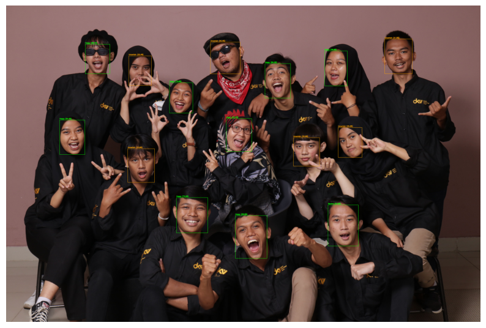
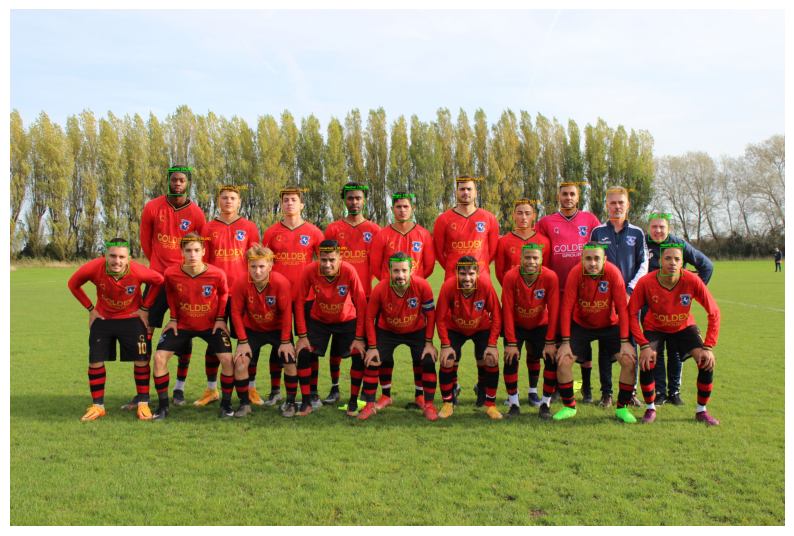
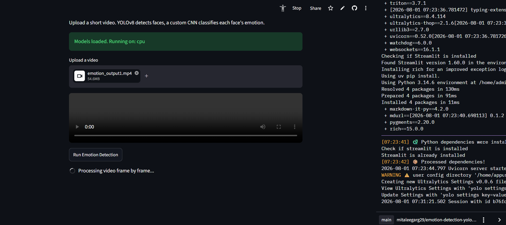
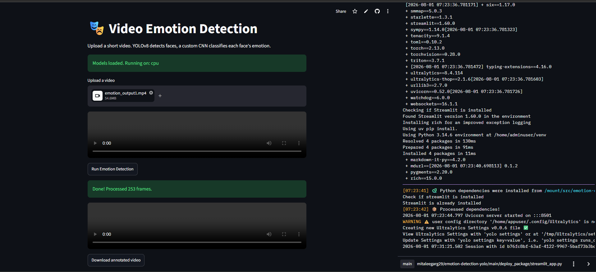
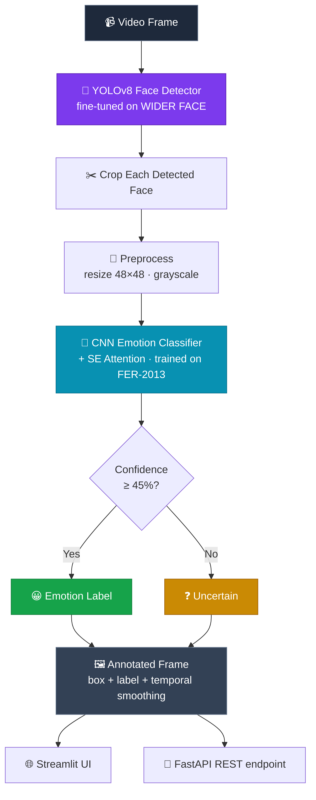
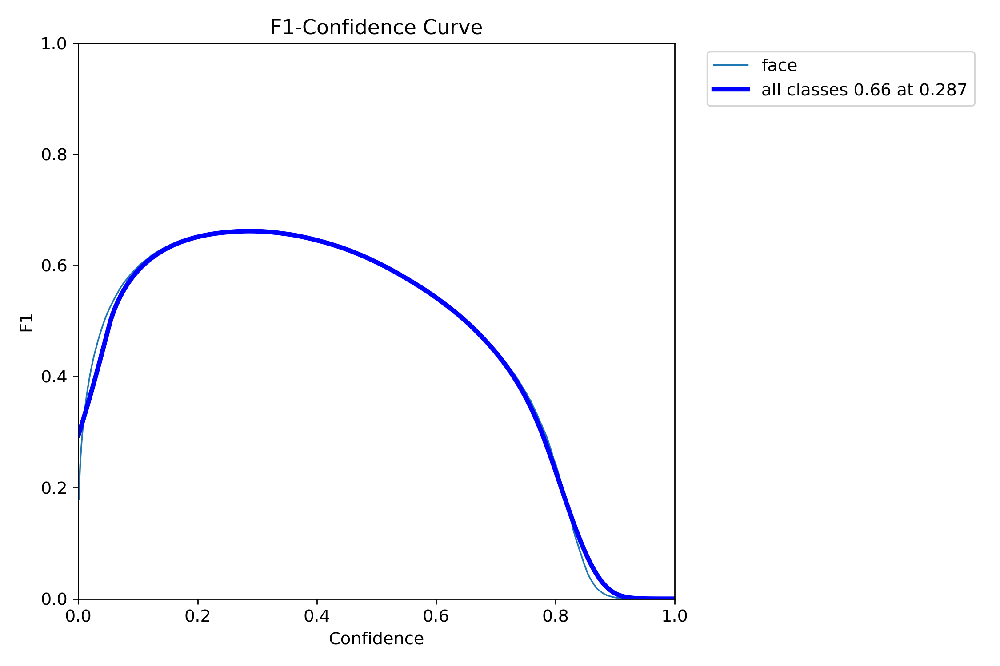
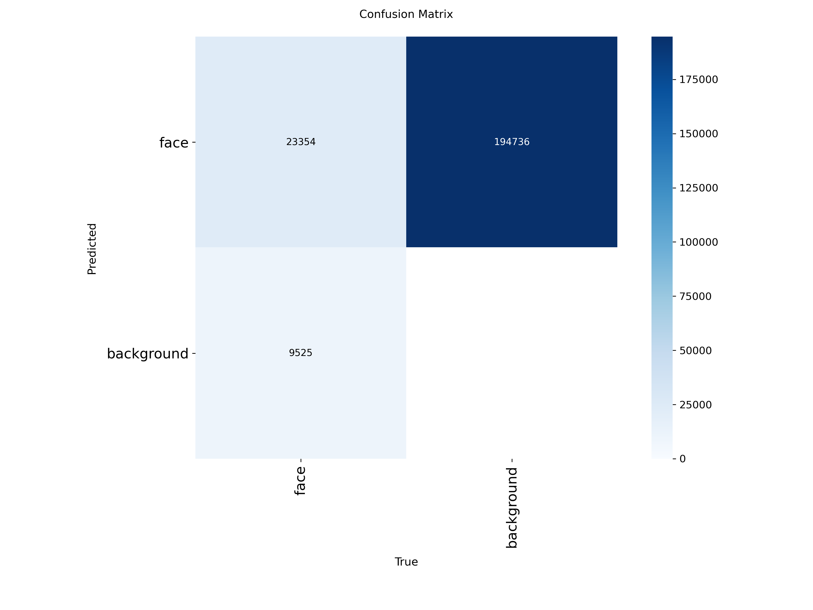
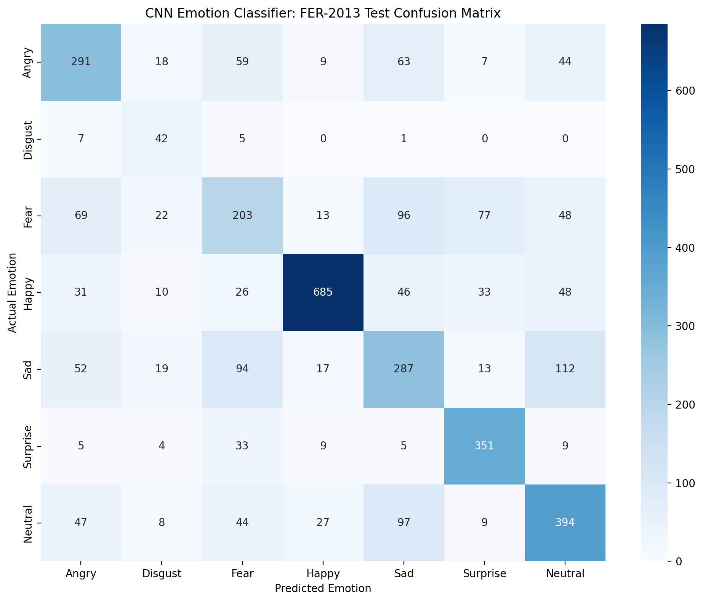

<div align="center">

# 🎭 Emotion Detection from Video
### YOLOv8 Face Detection + Custom CNN Emotion Classification

*A two-stage computer vision pipeline that finds faces in video and reads the emotion on each one, in real time.*

[](https://www.python.org/)
[](https://pytorch.org/)
[](https://github.com/ultralytics/ultralytics)
[](#-live-demo)
[](#-rest-api)
[](LICENSE)

**[🚀 Live Demo](#-live-demo)** · **[📊 Results](#-results)** · **[🏗️ Architecture](#️-architecture)** · **[⚡ Quickstart](#-quickstart)** · **[📄 Full Technical Docs](docs/TECHNICAL_DOCUMENTATION.md)**

</div>

---

## 🎬 See It In Action

<div align="center">

<!-- Replace this with your own GIF — see assets/README.md for a 2-line ffmpeg command to make one from emotion_output.mp4 -->


*Faces detected with YOLOv8, each cropped and classified into one of 7 emotions by a custom CNN, with bounding boxes, live confidence scores, and an "Uncertain" fallback when the model isn't sure.*

</div>

---

## 🚀 Live Demo

| | |
|---|---|
| 🌐 **Web app** | _[https://emotion-detection-yolo.streamlit.app/)]_ |
| 💻 **Source code** | _[https://github.com/MitaleeGarg29/Emotion-Detection-YOLO)]_ |
| 📓 **Full notebook** | [`notebooks/Emotion_detection.ipynb`](notebooks/Emotion_detection.ipynb) |

> **Note on deployment:** the live demo runs on CPU (Streamlit Community Cloud's free tier). Both models were deliberately kept lightweight (YOLOv8n, a 440K-parameter CNN) specifically so real-time inference doesn't require a GPU. The reasoning behind this tradeoff — including why Hugging Face's GPU tier wasn't available — is documented in full in [Section 8.3 of the technical docs](docs/TECHNICAL_DOCUMENTATION.md#83-cloud-deployment-platform-choice-and-honest-tradeoffs).

---

## 📸 Detection Gallery

Real, unposed test photos; not curated demo images, showing the pipeline handling genuinely difficult conditions: many faces at once, sunglasses, extreme angles, and hands partially covering faces.

<div align="center">



*A 16-person group photo, every face detected across varied lighting, angle, and distance from camera, despite no single face being front-and-center.*

<br><br>



*A much harder case: hands covering parts of faces, sunglasses, extreme expressions, and tilted heads, stress-testing the detector well beyond a standard front-facing photo.*

</div>

---

## 🖥️ Web App in Action

<div align="center">


</div>

<div align="center"><i>Upload a video → the pipeline processes it frame-by-frame → annotated output with bounding boxes and emotion labels, playable and downloadable directly in the browser.</i></div>

---

## 🏗️ Architecture



**Why two separate models, not one?** WIDER FACE (used for detection) contains *no emotion labels*; FER-2013 (used for classification) contains *no bounding boxes*. Neither dataset alone can train a single "detect + classify" model, the architecture follows directly from the data. Full reasoning in [Section 2 of the technical docs](docs/TECHNICAL_DOCUMENTATION.md#2-architecture-decision-two-separate-models-not-one).

---

## 📊 Results

### Face Detector — YOLOv8n fine-tuned on WIDER FACE

<div align="center">


</div>

| Metric | Value |
|---|---|
| Precision | **83.50%** |
| Recall | 54.92% |
| F1-score | 66.26% |
| mAP50 | 61.11% |
| mAP50-95 | 31.51% |
| Inference speed | **~5.2 ms/image** (~190 FPS theoretical, T4 GPU) |

*Validated on 2,576 held-out images never seen during training. The recall/speed tradeoff is deliberate, the smallest YOLOv8 variant was chosen to prioritize real-time throughput. See [Section 4.5](docs/TECHNICAL_DOCUMENTATION.md#45-training-results) for the full breakdown.*

### Emotion Classifier — Custom CNN + SE Attention on FER-2013

<div align="center">

</div>

| Metric | Value |
|---|---|
| Test accuracy | **62.78%** |
| Weighted F1-score | 62.93% |
| Macro F1-score | 59.66% |

| Emotion | Precision | Recall | F1-score |
|---|---|---|---|
| 😊 Happy | 0.901 | 0.779 | **0.836** |
| 😲 Surprise | 0.716 | 0.844 | 0.775 |
| 😐 Neutral | 0.602 | 0.629 | 0.615 |
| 😠 Angry | 0.580 | 0.593 | 0.586 |
| 😢 Sad | 0.482 | 0.483 | 0.483 |
| 🤢 Disgust | 0.341 | **0.764** | 0.472 |
| 😨 Fear | 0.438 | 0.384 | 0.409 |

*Tested on 3,589 held-out images. Disgust's high recall / low precision is a direct, visible effect of class-weighting a 16.5× minority class — not an accident. Full per-class discussion, including why Fear underperforms, in [Section 5.6](docs/TECHNICAL_DOCUMENTATION.md#56-training-results).*

---

## ✨ Key Features

- 🎯 **Fine-tuned YOLOv8** face detector, trained on WIDER FACE with augmentation targeted at the brief's named challenges (lighting via brightness jitter, occlusion via mosaic augmentation)
- 🧠 **Custom CNN with Squeeze-and-Excitation attention**,  a lightweight (440K param) architecture that learns to dynamically focus on whichever facial region best distinguishes commonly-confused emotions (e.g. fear vs. surprise)
- ⚖️ **Weighted Focal Loss** to handle FER-2013's 16.5× class imbalance, addressing both rare classes *and* hard-to-classify examples in one loss function
- 🎥 **Temporal smoothing** across frames (IoU-based face tracking + smoothed predictions) to eliminate flicker in video output
- ❓ **Confidence-based "Uncertain" handling** — the pipeline says "I don't know" rather than confidently guessing wrong
- 🔌 **REST API** (FastAPI) returning per-frame detections as JSON
- 🌐 **Web interface** (Streamlit) for drag-and-drop video upload and annotated playback
- 📈 **Batch processing** with CSV logging and summary charts across multiple videos

---

## ⚡ Quickstart

### Run the web app locally

```bash
git clone https://github.com/<your-username>/emotion-detection-yolo.git
cd emotion-detection-yolo/deploy_package

pip install -r requirements.txt
streamlit run streamlit_app.py
```

### Run the REST API locally

```bash
cd api
pip install -r requirements.txt
uvicorn main:app --reload
# Visit http://localhost:8000/docs for interactive API docs
```

### Use the models directly in Python

```python
from ultralytics import YOLO
import torch
from inference import EmotionCNN  # see deploy_package/inference.py

face_model = YOLO("models/face_detector/best.pt")
emotion_model = EmotionCNN(num_classes=7)
emotion_model.load_state_dict(torch.load("models/emotion_classifier/best_emotion_model.pt")["model_state_dict"])
emotion_model.eval()
```

---

## 📁 Project Structure

```
emotion-detection-yolo/
├── notebooks/
│   └── Emotion_detection.ipynb      # Full pipeline: data prep → training → evaluation
├── models/
│   ├── face_detector/best.pt        # Fine-tuned YOLOv8n weights (~6 MB)
│   └── emotion_classifier/best_emotion_model.pt   # CNN weights (~5 MB)
├── deploy_package/                  # Self-contained Streamlit deployment
│   ├── streamlit_app.py
│   ├── inference.py
│   └── requirements.txt
├── api/                             # FastAPI REST service
│   ├── main.py
│   └── inference.py
├── outputs/
│   ├── metrics/                     # Confusion matrices, PR curves, classification reports
│   └── sample_videos/               # Test clips + annotated outputs
├── assets/                          # README images/GIFs
└── docs/
    └── TECHNICAL_DOCUMENTATION.md   # Full architecture rationale & decision log
```

---

## 🎥 Demo Clip

A short annotated clip is embedded at the top of this README as a GIF (`assets/demo.gif`). The full-resolution version is available on request — kept out of the repo directly to stay within GitHub's file size guidelines for web uploads.

---

## 🛠️ Tech Stack


---

## 📄 Full Documentation

This README covers the highlights. For the complete technical write-up, every architecture decision, the reasoning behind each dataset choice, the full deployment story (including the Hugging Face policy wall hit mid-project), and an honest accounting of what wasn't done and why — see:

**➡️ [docs/TECHNICAL_DOCUMENTATION.md](docs/TECHNICAL_DOCUMENTATION.md)**

---

## 📜 License

This project is released under the MIT License. Model weights and code are free to use, modify, and build on.

---

<div align="center">

Built by [Mitalee Garg](https://github.com/MitaleeGarg29) as a technical assessment project.

</div>
